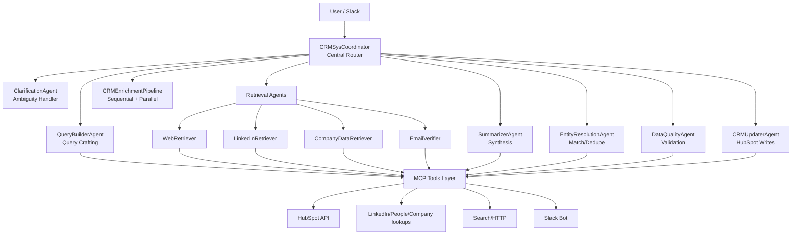

## Code Conversion Guide: Jira → CRM Data Enrichment & Cleanup

This document describes how to adapt the existing Jira multi-agent system to a CRM-focused assistant that automates data enrichment and cleanup (with HubSpot as the exemplar CRM). The conversion preserves the core architectural principles documented in `docs/MULTI_AGENT_ARCHITECTURE.md` and the patterns described in `README.md`, while redefining agents, tools, workflows, and state for CRM operations.

### Executive Summary

- Preserve coordinator/dispatcher, specialized agents, sequential/parallel workflows, typed state, MCP tools, error handling, and human-in-the-loop.
- Replace Jira-centric agents/tools with CRM enrichment/cleanup agents and HubSpot MCP tools.
- Add a Slack interface for natural-language queries and approval gates.

---

## Preserved Architectural Principles

Keep the following as-is from the architecture guide:
- Single Responsibility per agent; programmatic configuration; hierarchical delegation
- Typed shared state via Pydantic models
- Sequential pipelines and parallel fan-out/gather patterns
- Human-in-the-loop approval for write operations
- Error handling (fallbacks, circuit breaker) and observability

---

## Target Architecture (CRM)



---

## Agent Catalog & Responsibilities

- ClarificationAgent: Resolve ambiguous requests; request missing identifiers (contact email, company domain).
- QueryBuilderAgent: From a CRM record and detected gaps, craft precise queries for web/LinkedIn/company sources.
- WebRetriever: Execute web searches and site fetches; extract candidate facts (industry, HQ, staff size, tech stack mentions, competitor usage).
- LinkedInRetriever: Company/contact lookup; retrieve profile metadata (company size, specialties), respecting provider terms.
- CompanyDataRetriever: Enrichment from structured sources (e.g., Clearbit/Crunchbase/Datagma if available) via MCP tools.
- EmailVerifier: Validate email deliverability and catch-all domains via verification APIs.
- SummarizerAgent: Normalize and deduplicate findings; produce concise, source-attributed summaries.
- EntityResolutionAgent: Map findings to CRM objects/fields; handle dedupe and field precedence policy.
- DataQualityAgent: Validate required fields, taxonomy normalization (industry, lifecycle stage), and propose fixes.
- CRMUpdaterAgent: Prepare proposed CRM updates, request human approval, and apply writes to HubSpot.

Inputs/Outputs and state keys are defined in the state section below.

---

## Workflows

### Sequential: CRM Enrichment Pipeline

Steps (recommended):
1) GapDetection (DataQualityAgent) → identifies missing/outdated fields
2) QueryPlanning (QueryBuilderAgent) → constructs search tasks
3) ParallelRetrieval (Parallel group) → Web/LinkedIn/CompanyData/EmailVerifier
4) Synthesis (SummarizerAgent) → normalized insights + confidence + sources
5) EntityMatch (EntityResolutionAgent) → field mapping and dedupe
6) Proposal (CRMUpdaterAgent) → proposed changes persisted to state
7) HumanApproval (Approval Gate) → approve selected changes
8) ApplyUpdates (CRMUpdaterAgent) → write to HubSpot + report

Reference implementation, reusing patterns from the architecture guide:

```python
# Pseudocode showing composition using existing templates
enrichment_parallel = create_parallel_workflow(
    name="CRMParallelRetrieval",
    parallel_tasks=[
        ("Web", web_retriever_agent, "web_findings"),
        ("LinkedIn", linkedin_retriever_agent, "li_findings"),
        ("CompanyData", company_data_agent, "company_findings"),
        ("EmailVerify", email_verifier_agent, "email_validation")
    ],
    aggregator_agent=summarizer_agent  # reads all above outputs
)

enrichment_pipeline = create_sequential_workflow(
    name="CRMEnrichmentPipeline",
    steps=[
        ("GapDetection", data_quality_agent, "detected_gaps"),
        ("QueryPlanning", query_builder_agent, "search_plan"),
        ("ParallelRetrieval", enrichment_parallel, "parallel_outputs"),
        ("Synthesis", summarizer_agent, "normalized_insights"),
        ("EntityMatch", entity_resolution_agent, "proposed_field_map"),
        ("Proposal", crm_updater_agent, "proposed_changes"),
        ("HumanApproval", approval_agent, "approved_changes"),
        ("ApplyUpdates", crm_updater_agent, "update_results")
    ]
)
```

### Slack Interaction

- Natural language queries like: "Summarize ACME Corp and update industry + employee count if confident."
- Approval flows: bot posts proposed changes; user approves all or selected fields.

---

## Typed State (CRM)

```python
from pydantic import BaseModel, Field
from typing import Any, Dict, List, Optional
from datetime import datetime
import uuid

class CRMSessionState(BaseModel):
    # Identifiers
    contact_id: Optional[str] = None
    company_id: Optional[str] = None
    contact_email: Optional[str] = None
    company_domain: Optional[str] = None

    # Data health
    data_loaded: bool = False
    load_timestamp: Optional[datetime] = None

    # Findings
    web_findings: List[Dict[str, Any]] = Field(default_factory=list)
    li_findings: List[Dict[str, Any]] = Field(default_factory=list)
    company_findings: List[Dict[str, Any]] = Field(default_factory=list)
    email_validation: Dict[str, Any] = Field(default_factory=dict)
    normalized_insights: Dict[str, Any] = Field(default_factory=dict)

    # Quality
    detected_gaps: Dict[str, Any] = Field(default_factory=dict)
    proposed_field_map: Dict[str, Any] = Field(default_factory=dict)
    proposed_changes: List[Dict[str, Any]] = Field(default_factory=list)
    approved_changes: List[Dict[str, Any]] = Field(default_factory=list)
    update_results: Dict[str, Any] = Field(default_factory=dict)

    # Interaction
    active_agent: Optional[str] = None
    agent_history: List[str] = Field(default_factory=list)
    routing_decisions: List[Dict[str, str]] = Field(default_factory=list)
    pending_approvals: List[Dict[str, Any]] = Field(default_factory=list)

    # Session metadata
    session_id: str = Field(default_factory=lambda: str(uuid.uuid4()))
    created_at: datetime = Field(default_factory=datetime.now)
    last_updated: datetime = Field(default_factory=datetime.now)

    def update_timestamp(self):
        self.last_updated = datetime.now()
```

```python
class CRMStateKeys:
    CONTACT_ID = "contact_id"
    COMPANY_ID = "company_id"
    SEARCH_PLAN = "search_plan"
    WEB_FINDINGS = "web_findings"
    LI_FINDINGS = "li_findings"
    COMPANY_FINDINGS = "company_findings"
    EMAIL_VALIDATION = "email_validation"
    NORMALIZED = "normalized_insights"
    DETECTED_GAPS = "detected_gaps"
    FIELD_MAP = "proposed_field_map"
    PROPOSED = "proposed_changes"
    APPROVED = "approved_changes"
    UPDATE_RESULTS = "update_results"
```

---

## MCP Tools (CRM)

### HubSpot Official MCP Server Integration

HubSpot provides an official MCP server at `https://mcp.hubspot.com/` that we can integrate with directly. This eliminates the need to build custom HubSpot API wrappers.

**Key Benefits:**
- Official HubSpot support with natural language querying
- OAuth 2.1 authentication with PKCE and refresh token rotation
- Read-only access to CRM objects: contacts, companies, deals, tickets, carts, products, orders, line items, invoices, quotes, subscriptions
- Granular permissions based on app scopes and user permissions

**Setup Requirements:**
1. Create HubSpot app on developer platform (v2025.2+)
2. Configure as user-level OAuth marketplace app
3. Set required scopes: `oauth`, `crm.objects.contacts.read`, `crm.objects.companies.read`, `crm.objects.tickets.read`
4. Optional scopes: `crm.objects.deals.read`, `crm.objects.products.read`, etc.
5. Install app via OAuth flow to generate access/refresh tokens

**MCP Client Configuration:**
- Transport Type: Streamable HTTP
- URL: `https://mcp.hubspot.com/`
- Bearer Token: OAuth access token
- Client ID: HubSpot app client ID

### Custom CRM Tools Server

Implement a `CRMFastMCPServer` for non-HubSpot tools (web search, LinkedIn, email verification, Slack integration):

```python
class CRMFastMCPServer:
    def __init__(self):
        self.mcp = FastMCP("CRM Tool Server")
        self._register_tools()

    def _register_tools(self):
        # HubSpot integration tools (proxy to official MCP server)
        @self.mcp.tool()
        def query_hubspot_crm(query: str, object_type: str = "contacts") -> str:
            """Natural language query to HubSpot official MCP server."""
            # Proxy request to https://mcp.hubspot.com/ with OAuth token
            ...

        @self.mcp.tool()
        def get_hubspot_contact(contact_id: str = None, email: str = None) -> str:
            """Get contact details via HubSpot MCP server."""
            ...

        @self.mcp.tool()
        def get_hubspot_company(company_id: str = None, domain: str = None) -> str:
            """Get company details via HubSpot MCP server."""
            ...

        @self.mcp.tool()
        def web_search(query: str) -> str:
            """General web search (SERP API)."""
            ...

        @self.mcp.tool()
        def fetch_url(url: str) -> str:
            """Fetch and extract content from a URL."""
            ...

        @self.mcp.tool()
        def linkedin_company_lookup(name: str = None, domain: str = None) -> str:
            """Lookup company metadata (provider-dependent)."""
            ...

        @self.mcp.tool()
        def verify_email(email: str) -> str:
            """Verify email deliverability and risk."""
            ...

        @self.mcp.tool()
        def await_human_approval(proposed_changes: List[Dict[str, Any]], context: str = "CRM Updates") -> List[Dict]:
            """Post to Slack and await approval decision."""
            ...

        @self.mcp.tool()
        def notify_slack(message: str) -> str:
            """Send a Slack notification to the configured channel."""
            ...
```

Notes
- Respect platform ToS and rate limits for LinkedIn/3rd-party sources.
- All writes to CRM must be gated behind HumanApproval unless explicitly configured for auto-apply at high confidence.

---

## Coordinator & Factory

Use the existing `AgentFactory` and coordinator templates, registering CRM-specific agents and workflows.

```python
factory = AgentFactory("crm")

factory.register_agent_type(
    "query_builder",
    AgentTemplates.create_analysis_agent_template("crm", ["web_search", "fetch_url"]),
    {"description": "Build search plans from CRM gaps"}
)

factory.register_agent_type(
    "web_retriever",
    AgentTemplates.create_query_agent_template("crm", ["web_search", "fetch_url"]),
    {"description": "General web retrieval"}
)

# ... register linkedin_retriever, company_data, email_verifier, summarizer,
# entity_resolution, data_quality, crm_updater, approval_agent, workflows

coordinator = CoordinatorBuilder("CRM").build_coordinator()
```

Routing suggestions
- If request mentions "update", route to `CRMUpdaterAgent` via the approval workflow.
- If request asks for "summary" or "what do we know", route to Summarizer with auto-load of CRM record.
- If request names a contact/company, first ensure `load_crm_contact`/`search_company_by_domain` succeeds.

Model defaults
- Use Google Gemini 2.5 Flash as the LLM default for all agents.

---

## Configuration & Environment

### HubSpot App Setup

Create a HubSpot app with the following configuration:

```json
{
  "uid": "crm-enrichment-app",
  "type": "app",
  "config": {
    "description": "Multi-agent CRM enrichment and cleanup assistant",
    "name": "CRM Assistant",
    "distribution": "marketplace",
    "isUserLevel": true,
    "auth": {
      "type": "oauth",
      "redirectUrls": [
        "http://localhost:3000/oauth-callback",
        "https://your-domain.com/oauth-callback"
      ],
      "requiredScopes": [
        "oauth",
        "crm.objects.contacts.read",
        "crm.objects.companies.read",
        "crm.objects.tickets.read"
      ],
      "optionalScopes": [
        "crm.objects.deals.read",
        "crm.objects.products.read",
        "crm.objects.orders.read",
        "crm.objects.line_items.read",
        "crm.objects.invoices.read",
        "crm.objects.quotes.read",
        "crm.objects.subscriptions.read",
        "crm.objects.users.read",
        "crm.objects.owners.read"
      ]
    },
    "permittedUrls": {
      "fetch": ["https://api.hubapi.com", "https://mcp.hubspot.com"],
      "iframe": [],
      "img": []
    }
  }
}
```

### Environment Variables

- HUBSPOT_CLIENT_ID: HubSpot app client ID
- HUBSPOT_CLIENT_SECRET: HubSpot app client secret
- HUBSPOT_ACCESS_TOKEN: OAuth access token (from install flow)
- HUBSPOT_REFRESH_TOKEN: OAuth refresh token
- HUBSPOT_MCP_URL: https://mcp.hubspot.com/ (default)
- SLACK_BOT_TOKEN and SLACK_APP_TOKEN: for Slack bot/Socket Mode
- SEARCH_API_KEY: SERP/web search provider key
- LINKEDIN_API_KEY: LinkedIn API access (optional)
- EMAIL_VERIFY_API_KEY: Email verification service key
- PRIVACY_MODE=true: redact PII from logs and restrict data egress

### Python Dependencies (augment `requirements.txt`)

```
# HubSpot integration
httpx>=0.25.0
mcp>=1.0.0

# Slack integration  
slack_sdk>=3.21.0

# Web scraping and search
requests>=2.31.0
beautifulsoup4>=4.12.0
lxml>=4.9.0

# Data processing
pydantic>=2.0.0
tenacity>=8.2.0

# Optional: LinkedIn/company data
# clearbit-python>=0.1.7
# python-linkedin-v2>=0.9.0
```

### OAuth Setup Steps

1. **Create HubSpot App**: Use `hs project upload` with the configuration above
2. **Set up OAuth Server**: Implement OAuth 2.1 with PKCE support
3. **Install App**: Use install URL to generate access/refresh tokens
4. **Configure MCP Client**: Connect to `https://mcp.hubspot.com/` with tokens
5. **Test Integration**: Use MCP Inspector to verify connection and available tools

### MCP Client Configuration Example

```python
from mcp import Client
import httpx

# Configure MCP client for HubSpot
hubspot_mcp_client = Client(
    transport_type="streamable_http",
    url="https://mcp.hubspot.com/",
    headers={
        "Authorization": f"Bearer {hubspot_access_token}",
        "X-Client-ID": hubspot_client_id
    }
)

# Test connection
tools = await hubspot_mcp_client.list_tools()
user_details = await hubspot_mcp_client.call_tool("get_user_details")
```

---

## Migration Checklist & Jira→CRM Mapping

Directory and module mapping
- `jira_fastmcp_server/` → `crm_fastmcp_server/` (new) with CRM tools
- `jira_agent/agents/specialized/` → `jira_agent/agents/specialized/` (add CRM-focused agents alongside or create `crm_agent/` if you prefer full separation)
- `jira_agent/agents/workflows/` → add `crm_enrichment.py` with sequential/parallel workflow
- `jira_agent/core/state_models.py` → add `CRMSessionState` and `CRMStateKeys`
- `jira_agent/coordination/coordinator.py` → extend to register CRM agents/workflows; or add `crm_coordinator.py`
- `tests/test_enhanced_system.py` → add `tests/test_crm_system.py` for CRM flows
- `docs/jira_exports/` → not required; HubSpot is the data source. Optionally add `docs/crm_samples/` for fixtures

Agent renames/additions
- QueryAgent → QueryBuilderAgent (purpose shift: plan queries)
- AnalysisAgent → SummarizerAgent (CRM insights)
- ReportingAgent → remains for executive output, optional
- DataQualityAgent → extend with CRM field validation and taxonomy normalization
- Add: WebRetriever, LinkedInRetriever, CompanyDataRetriever, EmailVerifier, EntityResolutionAgent, CRMUpdaterAgent, ApprovalAgent

Tool replacements
- Replace Jira tools with: HubSpot reads/writes, web search/fetch, LinkedIn/company data, email verification, Slack approval

Human-in-the-loop
- Keep the approval gate; default to required for CRM writes

Security & compliance
- Treat contact/company data as PII. Redact in logs, encrypt secrets, and use least-privilege tokens

Smoke test plan
- Load a known contact; run enrichment; approve a subset; verify HubSpot shows updates; confirm Slack notifications

---

## Testing Strategy

Unit tests
- Each agent’s transform logic given deterministic tool responses

Integration tests
- Sequential pipeline executes steps in order; parallel retrieval aggregates correctly

E2E tests
- Simulate Slack request → approval → HubSpot update (mock HubSpot and Slack APIs)

Example skeleton
```python
class TestCRMWorkflow:
    def test_enrichment_pipeline_e2e(self, mock_hubspot, mock_slack, fixtures):
        state = CRMSessionState(contact_email="user@example.com")
        result = enrichment_pipeline.execute({"state": state})
        assert result.final_output is not None
        assert state.proposed_changes
```

---

## Rollout Notes

- Start read-only (no writes) to validate retrieval, synthesis, and field mapping
- Enable approval-only writes for a pilot group in Slack
- Gradually enable auto-apply for low-risk, high-confidence fields (e.g., industry from multiple sources)

---

## FAQ

- Can we support CRMs other than HubSpot? Yes—abstract CRM tools behind MCP; implement Salesforce, Pipedrive, etc., with identical agent/workflow contracts.
- Is LinkedIn mandatory? No—swap in other company data providers; keep the Retrieval interface stable.
- Do we need Slack? No—any chat/ops interface works; Slack is a recommended default.

---

This guide preserves the architectural backbone while refocusing the system on CRM enrichment and cleanup with human oversight and strong data hygiene.


