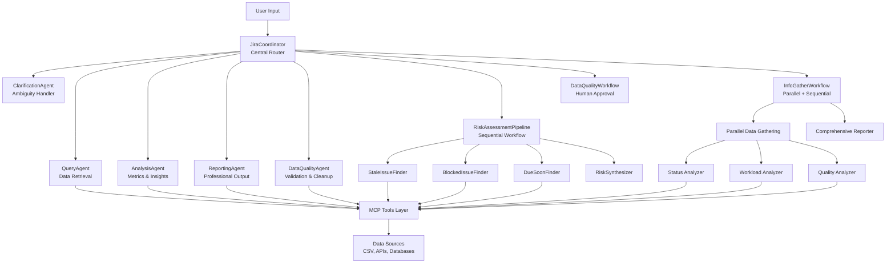

# Multi-Agent System Architecture Guide

A comprehensive guide to building scalable multi-agent systems using Google's Agent Development Kit (ADK). This document provides detailed patterns, implementation strategies, and reusable architectural components that can be adapted for any domain beyond Jira analysis.

## 🎯 Executive Summary

This architecture demonstrates how to build production-ready multi-agent systems using proven patterns from distributed systems and microservices. The design emphasizes **type safety**, **composability**, **testability**, and **maintainability** while providing **intelligent routing**, **state management**, and **workflow orchestration**.

### Key Architectural Principles

1. **Single Responsibility Principle**: Each agent has one clear domain of expertise
2. **Programmatic Configuration**: Python-based setup for IDE support and type safety
3. **Hierarchical Delegation**: Coordinator → Specialized → Workflow patterns
4. **Shared State Management**: Type-safe communication through Pydantic models
5. **Graceful Degradation**: Robust error handling with fallback mechanisms
6. **Human-in-the-Loop**: Explicit approval workflows for critical operations

---

## 🏛️ Architectural Overview

### System Layers



---

## 🧩 Core Architectural Patterns

### 1. Coordinator/Dispatcher Pattern

**Purpose**: Centralized routing with intelligent delegation based on request analysis.

**Implementation**:
```python
# Coordinator Pattern Structure
def create_coordinator() -> LlmAgent:
    coordinator = LlmAgent(
        name='SystemCoordinator',
        description='Central routing agent',
        instruction="""
        Analyze user requests and route to appropriate specialized agents.
        
        ROUTING RULES:
        1. Analyze request intent and domain
        2. Route to most specific agent available
        3. Use ClarificationAgent for ambiguous requests
        4. Ensure data loading before delegation
        """,
        sub_agents=[
            specialized_agents...,
            workflow_agents...,
            clarification_agent
        ]
    )
    return coordinator
```

**Key Benefits**:
- **Single Entry Point**: Users interact with one interface
- **Intelligent Routing**: LLM-driven decision making for complex requests
- **Extensibility**: Add new agents without changing coordinator logic
- **Fallback Handling**: Graceful handling of ambiguous requests

**Reusability Pattern**:
```python
# Generic Coordinator Template
class CoordinatorBuilder:
    def __init__(self, domain: str):
        self.domain = domain
        self.agents = []
        self.workflows = []
    
    def add_specialized_agent(self, agent_factory, routing_keywords):
        self.agents.append((agent_factory, routing_keywords))
    
    def add_workflow(self, workflow_factory, trigger_patterns):
        self.workflows.append((workflow_factory, trigger_patterns))
    
    def build_coordinator(self) -> LlmAgent:
        # Generate routing instruction based on registered agents
        routing_rules = self._generate_routing_rules()
        
        return LlmAgent(
            name=f'{self.domain}Coordinator',
            instruction=routing_rules,
            sub_agents=self._create_all_agents()
        )
```

### 2. Specialized Agent Pattern

**Purpose**: Domain-specific expertise with focused responsibilities.

**Implementation**:
```python
# Base Specialized Agent Template
class SpecializedAgentFactory:
    def create_domain_agent(
        self,
        domain: str,
        tools: List[str],
        expertise_instruction: str,
        auto_load_data: bool = True
    ) -> LlmAgent:
        
        instruction = f"""
        You are a specialized {domain} agent.
        
        {'🚀 AUTO-LOAD: Load data immediately on first interaction.' if auto_load_data else ''}
        
        DOMAIN EXPERTISE: {expertise_instruction}
        
        AVAILABLE TOOLS: {', '.join(tools)}
        
        BEHAVIOR:
        1. Focus exclusively on {domain} operations
        2. Provide expert-level insights in your domain
        3. Save results to session state for other agents
        4. Suggest follow-up actions within your expertise
        """
        
        return SpecializedAgent(
            name=f'{domain}Agent',
            domain=domain,
            specialized_tools=tools,
            instruction=instruction
        )
```

**Domain Examples**:
- **QueryAgent**: Data retrieval, search, filtering
- **AnalysisAgent**: Statistical analysis, pattern recognition
- **ReportingAgent**: Professional formatting, executive summaries
- **ValidationAgent**: Data quality, consistency checking
- **SecurityAgent**: Access control, audit logging
- **NotificationAgent**: Alerts, communications, escalations

**Reusability Benefits**:
- **Clear Boundaries**: Each agent has well-defined responsibilities
- **Easy Testing**: Isolated functionality for unit testing
- **Parallel Development**: Teams can work on different agents independently
- **Performance Optimization**: Agents can be optimized for their specific tasks

### 3. Sequential Pipeline Pattern

**Purpose**: Multi-step workflows where each step depends on the previous one.

**Implementation**:
```python
# Sequential Pipeline Template
def create_sequential_workflow(
    name: str,
    steps: List[Tuple[str, LlmAgent, str]]  # (step_name, agent, output_key)
) -> SequentialAgent:
    
    # Configure each step with proper state management
    configured_steps = []
    for step_name, agent, output_key in steps:
        # Clone agent with workflow-specific instruction
        workflow_agent = clone_agent_with_instruction(
            agent,
            f"""
            You are step '{step_name}' in a sequential workflow.
            
            WORKFLOW CONTEXT:
            - Previous steps have saved data to session state
            - Use state interpolation to access previous results
            - Save your results using output_key="{output_key}"
            
            STEP RESPONSIBILITY: {agent.description}
            """
        )
        configured_steps.append(workflow_agent)
    
    return SequentialAgent(
        name=name,
        description=f"Sequential workflow: {' → '.join([s[0] for s in steps])}",
        sub_agents=configured_steps
    )
```

**Example - Risk Assessment Pipeline**:
```python
risk_pipeline = create_sequential_workflow(
    name="RiskAssessmentPipeline",
    steps=[
        ("StaleDetection", stale_finder, "stale_issues"),
        ("BlockedDetection", blocked_finder, "blocked_issues"),
        ("DeadlineAnalysis", due_analyzer, "due_soon_issues"),
        ("RiskSynthesis", risk_synthesizer, "risk_report")
    ]
)
```

**State Flow Example**:
```python
# Step 1: StaleDetection saves to "stale_issues"
# Step 2: BlockedDetection saves to "blocked_issues"  
# Step 3: DeadlineAnalysis saves to "due_soon_issues"
# Step 4: RiskSynthesis reads all previous results:
synthesizer_instruction = """
Analyze risk data from previous steps:
- Stale Issues: {stale_issues}
- Blocked Issues: {blocked_issues}
- Due Soon: {due_soon_issues}

Generate comprehensive risk assessment with:
1. Overall risk score (0-10)
2. Priority recommendations
3. Specific action items
"""
```

### 4. Parallel Fan-Out/Gather Pattern

**Purpose**: Concurrent execution of independent tasks with result aggregation.

**Implementation**:
```python
# Parallel Pattern Template
def create_parallel_workflow(
    name: str,
    parallel_tasks: List[Tuple[str, LlmAgent, str]],  # (task_name, agent, output_key)
    aggregator_agent: LlmAgent
) -> SequentialAgent:
    
    # Create parallel execution group
    parallel_group = ParallelAgent(
        name=f"{name}ParallelGroup",
        sub_agents=[
            configure_parallel_agent(agent, output_key) 
            for task_name, agent, output_key in parallel_tasks
        ]
    )
    
    # Configure aggregator to read all parallel results
    parallel_outputs = [output_key for _, _, output_key in parallel_tasks]
    aggregator = configure_aggregator(aggregator_agent, parallel_outputs)
    
    # Combine parallel + sequential for complete workflow
    return SequentialAgent(
        name=name,
        sub_agents=[parallel_group, aggregator]
    )
```

**Example - Comprehensive Analysis**:
```python
info_workflow = create_parallel_workflow(
    name="ComprehensiveAnalysis",
    parallel_tasks=[
        ("StatusAnalysis", status_agent, "status_data"),
        ("WorkloadAnalysis", workload_agent, "workload_data"),
        ("QualityAnalysis", quality_agent, "quality_data"),
        ("TrendAnalysis", trend_agent, "trend_data")
    ],
    aggregator_agent=comprehensive_reporter
)
```

**Performance Benefits**:
- **Concurrent Execution**: Independent tasks run simultaneously
- **Reduced Latency**: Total time = max(individual_times) instead of sum
- **Resource Utilization**: Better use of available compute resources
- **Scalability**: Easy to add more parallel tasks

### 5. Human-in-the-Loop Pattern

**Purpose**: Explicit user approval for critical or destructive operations.

**Implementation**:
```python
# Human Approval Pattern
class HumanApprovalWorkflow:
    def create_approval_workflow(
        self,
        analysis_agent: LlmAgent,
        approval_tool: FunctionTool,
        execution_agent: LlmAgent
    ) -> SequentialAgent:
        
        # Step 1: Analysis and recommendation
        analyzer = configure_agent(analysis_agent, """
        Analyze the situation and provide:
        1. Current state assessment
        2. Proposed changes with rationale
        3. Risk analysis
        4. Detailed change plan
        
        Save recommendations using output_key="proposed_changes"
        """)
        
        # Step 2: Human approval gate
        approval_agent = LlmAgent(
            name="HumanApprovalGate",
            instruction="""
            Present proposed changes to user for approval.
            Use the approval tool to get user decision.
            Save approved changes using output_key="approved_changes"
            """,
            tools=[approval_tool]
        )
        
        # Step 3: Execution of approved changes
        executor = configure_agent(execution_agent, """
        Execute only the approved changes from session state.
        Read approved changes from: {approved_changes}
        Provide detailed execution report.
        """)
        
        return SequentialAgent(
            name="HumanApprovalWorkflow",
            sub_agents=[analyzer, approval_agent, executor]
        )
```

**Approval Tool Example**:
```python
async def await_human_approval(
    proposed_changes: List[Dict],
    context: str = "System Changes"
) -> List[Dict]:
    """Present changes to user and await approval."""
    
    # Format changes for user presentation
    formatted_changes = format_changes_for_display(proposed_changes)
    
    # Present to user with clear options
    user_response = await present_to_user(
        title=f"Approve {context}",
        changes=formatted_changes,
        options=["approve_all", "approve_selected", "reject_all", "modify"]
    )
    
    # Process user decision
    match user_response["action"]:
        case "approve_all":
            return proposed_changes
        case "approve_selected":
            return user_response["selected_changes"]
        case "modify":
            return user_response["modified_changes"]
        case _:
            return []  # Rejection
```

---

## 🔧 State Management Architecture

### Typed State Models

**Purpose**: Type-safe communication between agents with validation and consistency.

```python
# Core State Model Template
class SystemSessionState(BaseModel):
    """Central session state for multi-agent communication."""
    
    # Data loading state
    data_loaded: bool = False
    data_source: Optional[str] = None
    load_timestamp: Optional[datetime] = None
    
    # Domain-specific data
    raw_data: List[Dict[str, Any]] = Field(default_factory=list)
    processed_data: List[Dict[str, Any]] = Field(default_factory=list)
    
    # Analysis results (typed sub-models)
    analysis_results: Dict[str, Any] = Field(default_factory=dict)
    reports: Dict[str, Any] = Field(default_factory=dict)
    
    # Agent interaction tracking
    active_agent: Optional[str] = None
    agent_history: List[str] = Field(default_factory=list)
    routing_decisions: List[Dict[str, str]] = Field(default_factory=list)
    
    # User interaction
    pending_approvals: List[Dict[str, Any]] = Field(default_factory=list)
    user_preferences: Dict[str, Any] = Field(default_factory=dict)
    
    # Session metadata
    session_id: str = Field(default_factory=lambda: str(uuid.uuid4()))
    created_at: datetime = Field(default_factory=datetime.now)
    last_updated: datetime = Field(default_factory=datetime.now)
    
    # Utility methods
    def update_timestamp(self):
        self.last_updated = datetime.now()
    
    def add_routing_decision(self, from_agent: str, to_agent: str, reason: str):
        self.routing_decisions.append({
            "from": from_agent,
            "to": to_agent,
            "reason": reason,
            "timestamp": datetime.now().isoformat()
        })
        self.update_timestamp()
    
    def get_analysis_result(self, key: str, default=None):
        return self.analysis_results.get(key, default)
    
    def set_analysis_result(self, key: str, value: Any):
        self.analysis_results[key] = value
        self.update_timestamp()
```

### State Key Management

```python
# Type-safe state keys
class StateKeys:
    """Constants for session state keys."""
    
    # Data keys
    RAW_DATA = "raw_data"
    PROCESSED_DATA = "processed_data"
    
    # Analysis keys
    STATUS_BREAKDOWN = "status_breakdown"
    WORKLOAD_ANALYSIS = "workload_analysis"
    QUALITY_REPORT = "quality_report"
    RISK_ASSESSMENT = "risk_assessment"
    
    # Workflow keys
    PROPOSED_CHANGES = "proposed_changes"
    APPROVED_CHANGES = "approved_changes"
    EXECUTION_RESULTS = "execution_results"
    
    # Query results
    SEARCH_RESULTS = "search_results"
    FILTERED_DATA = "filtered_data"

# Usage in agents
def save_to_state(context, key: str, value: Any):
    """Type-safe state saving."""
    if hasattr(context.session, 'state'):
        context.session.state.set_analysis_result(key, value)
```

---

## 🛠️ Tool Integration Architecture

### MCP (Model Context Protocol) Integration

**Purpose**: Standardized tool interface for external system integration.

```python
# MCP Tool Server Template
class DomainMCPServer:
    def __init__(self, domain_name: str):
        self.mcp = FastMCP(f"{domain_name} Tool Server")
        self.domain = domain_name
        self._register_tools()
    
    def _register_tools(self):
        """Register domain-specific tools."""
        
        # Data loading tools
        @self.mcp.tool()
        def load_domain_data(source: str = None) -> str:
            """Load data from domain-specific sources."""
            return self._load_data_logic(source)
        
        # Query tools
        @self.mcp.tool()
        def search_domain_entities(
            query: str,
            filters: Dict[str, Any] = None
        ) -> str:
            """Search entities in domain data."""
            return self._search_logic(query, filters)
        
        # Analysis tools
        @self.mcp.tool()
        def analyze_domain_metrics() -> str:
            """Perform domain-specific analysis."""
            return self._analysis_logic()
        
        # Reporting tools
        @self.mcp.tool()
        def generate_domain_report(report_type: str) -> str:
            """Generate formatted reports."""
            return self._reporting_logic(report_type)
    
    def _load_data_logic(self, source: str) -> str:
        """Implement domain-specific data loading."""
        pass
    
    def _search_logic(self, query: str, filters: Dict) -> str:
        """Implement domain-specific search."""
        pass
    
    def _analysis_logic(self) -> str:
        """Implement domain-specific analysis."""
        pass
    
    def _reporting_logic(self, report_type: str) -> str:
        """Implement domain-specific reporting."""
        pass
```

### Tool Categories and Organization

```python
# Tool Category Organization
class ToolRegistry:
    def __init__(self):
        self.categories = {
            "data_loading": [],
            "query_search": [],
            "analysis": [],
            "reporting": [],
            "validation": [],
            "transformation": [],
            "integration": []
        }
    
    def register_tool(self, category: str, tool_func, metadata: Dict):
        """Register a tool in a specific category."""
        self.categories[category].append({
            "function": tool_func,
            "metadata": metadata
        })
    
    def get_tools_for_agent(self, agent_type: str) -> List:
        """Get relevant tools for a specific agent type."""
        tool_mapping = {
            "query": ["data_loading", "query_search"],
            "analysis": ["data_loading", "analysis", "validation"],
            "reporting": ["data_loading", "reporting", "transformation"],
            "quality": ["data_loading", "validation", "transformation"]
        }
        
        relevant_tools = []
        for category in tool_mapping.get(agent_type, []):
            relevant_tools.extend(self.categories[category])
        
        return relevant_tools
```

---

## 🏗️ Agent Factory Pattern

### Registry-Based Agent Creation

**Purpose**: Dynamic, testable, and extensible agent creation and management.

```python
# Generic Agent Factory Template
class AgentFactory:
    def __init__(self, domain: str):
        self.domain = domain
        self._agent_factories: Dict[str, Callable] = {}
        self._agent_metadata: Dict[str, Dict] = {}
        self._tool_registry = ToolRegistry()
    
    def register_agent_type(
        self,
        agent_type: str,
        factory_func: Callable,
        metadata: Dict,
        required_tools: List[str] = None
    ):
        """Register a new agent type."""
        self._agent_factories[agent_type] = factory_func
        self._agent_metadata[agent_type] = {
            **metadata,
            "required_tools": required_tools or []
        }
    
    def create_agent(
        self,
        agent_type: str,
        custom_instruction: str = None,
        additional_tools: List = None,
        **kwargs
    ) -> LlmAgent:
        """Create an agent instance."""
        
        if agent_type not in self._agent_factories:
            raise ValueError(f"Unknown agent type: {agent_type}")
        
        # Get factory and metadata
        factory = self._agent_factories[agent_type]
        metadata = self._agent_metadata[agent_type]
        
        # Get tools for this agent type
        agent_tools = self._tool_registry.get_tools_for_agent(agent_type)
        if additional_tools:
            agent_tools.extend(additional_tools)
        
        # Create agent with custom configuration
        return factory(
            instruction=custom_instruction or metadata.get("default_instruction"),
            tools=agent_tools,
            **kwargs
        )
    
    def list_agent_types(self) -> List[str]:
        """List all registered agent types."""
        return list(self._agent_factories.keys())
    
    def get_agent_info(self, agent_type: str) -> Dict:
        """Get information about an agent type."""
        return self._agent_metadata.get(agent_type, {})
```

### Agent Templates

```python
# Reusable Agent Templates
class AgentTemplates:
    @staticmethod
    def create_query_agent_template(domain: str, tools: List[str]) -> Callable:
        def factory(**kwargs):
            return SpecializedAgent(
                name=f"{domain}QueryAgent",
                domain="query",
                specialized_tools=tools,
                instruction=f"""
                You are a specialized query agent for {domain} data.
                
                CAPABILITIES:
                - Data retrieval and search
                - Filtering and sorting
                - Result aggregation
                
                TOOLS: {', '.join(tools)}
                
                Always provide clear, actionable results.
                """,
                **kwargs
            )
        return factory
    
    @staticmethod
    def create_analysis_agent_template(domain: str, tools: List[str]) -> Callable:
        def factory(**kwargs):
            return SpecializedAgent(
                name=f"{domain}AnalysisAgent",
                domain="analysis",
                specialized_tools=tools,
                instruction=f"""
                You are a specialized analysis agent for {domain} data.
                
                CAPABILITIES:
                - Statistical analysis
                - Pattern recognition
                - Trend identification
                - Metric calculation
                
                TOOLS: {', '.join(tools)}
                
                Provide insights with supporting evidence.
                """,
                **kwargs
            )
        return factory
    
    @staticmethod
    def create_workflow_template(
        name: str,
        workflow_type: str,  # "sequential" or "parallel"
        steps: List[Dict]
    ) -> Callable:
        def factory(**kwargs):
            if workflow_type == "sequential":
                return create_sequential_workflow(name, steps)
            elif workflow_type == "parallel":
                return create_parallel_workflow(name, steps)
            else:
                raise ValueError(f"Unknown workflow type: {workflow_type}")
        return factory
```

---

## 🧪 Testing Architecture

### Multi-Level Testing Strategy

```python
# Unit Testing for Individual Agents
class TestAgentBehavior:
    def setup_method(self):
        self.factory = AgentFactory("test_domain")
        self.mock_tools = create_mock_tool_set()
    
    def test_agent_creation(self):
        agent = self.factory.create_agent("query", tools=self.mock_tools)
        assert agent.name == "test_domainQueryAgent"
        assert len(agent.tools) > 0
    
    def test_agent_routing(self):
        coordinator = self.factory.create_agent("coordinator")
        
        # Test routing logic
        result = coordinator.route_request("find all items")
        assert result.target_agent == "QueryAgent"
    
    def test_state_management(self):
        agent = self.factory.create_agent("analysis")
        session_state = create_test_session_state()
        
        # Test state saving
        agent.save_result("test_key", "test_value", session_state)
        assert session_state.get_analysis_result("test_key") == "test_value"

# Integration Testing for Workflows
class TestWorkflowIntegration:
    def test_sequential_workflow(self):
        workflow = create_test_sequential_workflow()
        test_input = create_test_input()
        
        result = workflow.execute(test_input)
        
        # Verify each step executed in order
        assert len(result.step_results) == 4
        assert result.final_output is not None
    
    def test_parallel_workflow(self):
        workflow = create_test_parallel_workflow()
        test_input = create_test_input()
        
        result = workflow.execute(test_input)
        
        # Verify parallel execution
        assert result.execution_time < sum(step_times)
        assert all(step.completed for step in result.parallel_steps)

# System Integration Testing
class TestSystemIntegration:
    def test_end_to_end_workflow(self):
        # Test complete user journey
        system = create_test_system()
        
        # User request
        response = system.process_request("analyze project health")
        
        # Verify routing
        assert "AnalysisAgent" in response.agent_path
        
        # Verify data loading
        assert response.data_loaded is True
        
        # Verify results
        assert response.has_analysis_results()
        assert response.has_recommendations()
```

### Mock and Fixture Patterns

```python
# Test Fixtures and Mocks
class TestFixtures:
    @pytest.fixture
    def mock_mcp_server(self):
        """Mock MCP server for testing."""
        server = MockMCPServer()
        server.register_mock_tools()
        return server
    
    @pytest.fixture
    def sample_domain_data(self):
        """Sample data for testing."""
        return [
            {"id": 1, "status": "active", "priority": "high"},
            {"id": 2, "status": "completed", "priority": "medium"},
            {"id": 3, "status": "blocked", "priority": "low"}
        ]
    
    @pytest.fixture
    def test_session_state(self):
        """Test session state."""
        return SystemSessionState(
            session_id="test-session-123",
            data_loaded=True
        )
    
    def create_mock_agent(self, agent_type: str) -> LlmAgent:
        """Create a mock agent for testing."""
        return MockAgent(
            name=f"Mock{agent_type}Agent",
            responses=self._get_mock_responses(agent_type)
        )
    
    def _get_mock_responses(self, agent_type: str) -> Dict[str, str]:
        """Get predefined responses for mock agents."""
        return {
            "query": "Mock query results",
            "analysis": "Mock analysis results",
            "reporting": "Mock report generated"
        }
```

---

## 📊 Performance and Monitoring

### Performance Optimization Patterns

```python
# Performance Monitoring
class PerformanceMonitor:
    def __init__(self):
        self.metrics = {}
        self.timers = {}
    
    def start_timer(self, operation: str):
        self.timers[operation] = time.time()
    
    def end_timer(self, operation: str):
        if operation in self.timers:
            duration = time.time() - self.timers[operation]
            self._record_metric(f"{operation}_duration", duration)
            del self.timers[operation]
    
    def record_agent_performance(self, agent_name: str, metrics: Dict):
        agent_key = f"agent_{agent_name}"
        if agent_key not in self.metrics:
            self.metrics[agent_key] = []
        self.metrics[agent_key].append({
            "timestamp": datetime.now(),
            "metrics": metrics
        })
    
    def get_performance_report(self) -> Dict:
        return {
            "average_response_time": self._calculate_avg_response_time(),
            "agent_performance": self._analyze_agent_performance(),
            "bottlenecks": self._identify_bottlenecks(),
            "recommendations": self._generate_recommendations()
        }

# Caching Strategy
class AgentCache:
    def __init__(self):
        self.cache = {}
        self.cache_ttl = {}
    
    def cache_result(self, key: str, result: Any, ttl: int = 3600):
        """Cache agent results with TTL."""
        self.cache[key] = result
        self.cache_ttl[key] = time.time() + ttl
    
    def get_cached_result(self, key: str) -> Optional[Any]:
        """Get cached result if still valid."""
        if key in self.cache and time.time() < self.cache_ttl[key]:
            return self.cache[key]
        return None
    
    def invalidate_cache(self, pattern: str = None):
        """Invalidate cache entries."""
        if pattern:
            keys_to_remove = [k for k in self.cache.keys() if pattern in k]
            for key in keys_to_remove:
                del self.cache[key]
                del self.cache_ttl[key]
        else:
            self.cache.clear()
            self.cache_ttl.clear()
```

### Scalability Patterns

```python
# Agent Pool Management
class AgentPool:
    def __init__(self, max_agents: int = 10):
        self.max_agents = max_agents
        self.active_agents = {}
        self.agent_queue = queue.Queue()
        self.load_balancer = LoadBalancer()
    
    def get_agent(self, agent_type: str) -> LlmAgent:
        """Get an available agent or create new one."""
        if len(self.active_agents) < self.max_agents:
            agent = self._create_agent(agent_type)
            self.active_agents[agent.id] = agent
            return agent
        else:
            # Wait for available agent or use load balancing
            return self.load_balancer.get_least_busy_agent(agent_type)
    
    def release_agent(self, agent_id: str):
        """Release agent back to pool."""
        if agent_id in self.active_agents:
            del self.active_agents[agent_id]
    
    def scale_up(self, agent_type: str, count: int):
        """Scale up specific agent type."""
        for _ in range(count):
            if len(self.active_agents) < self.max_agents:
                agent = self._create_agent(agent_type)
                self.active_agents[agent.id] = agent
    
    def scale_down(self, agent_type: str, count: int):
        """Scale down specific agent type."""
        agents_to_remove = [
            aid for aid, agent in self.active_agents.items()
            if agent.agent_type == agent_type
        ][:count]
        
        for agent_id in agents_to_remove:
            self.release_agent(agent_id)
```

---

## 🔒 Security and Error Handling

### Security Patterns

```python
# Security Layer
class SecurityManager:
    def __init__(self):
        self.permissions = {}
        self.audit_log = []
    
    def check_permission(self, agent: str, operation: str, resource: str) -> bool:
        """Check if agent has permission for operation."""
        agent_perms = self.permissions.get(agent, set())
        required_perm = f"{operation}:{resource}"
        return required_perm in agent_perms
    
    def audit_operation(self, agent: str, operation: str, resource: str, result: str):
        """Log security-relevant operations."""
        self.audit_log.append({
            "timestamp": datetime.now(),
            "agent": agent,
            "operation": operation,
            "resource": resource,
            "result": result
        })
    
    def sanitize_input(self, input_data: Any) -> Any:
        """Sanitize user input before processing."""
        # Implement input validation and sanitization
        return sanitized_input
    
    def encrypt_sensitive_data(self, data: Dict) -> Dict:
        """Encrypt sensitive fields in data."""
        sensitive_fields = ["password", "token", "key", "secret"]
        encrypted_data = data.copy()
        
        for field in sensitive_fields:
            if field in encrypted_data:
                encrypted_data[field] = self._encrypt(encrypted_data[field])
        
        return encrypted_data
```

### Error Handling and Recovery

```python
# Robust Error Handling
class ErrorHandler:
    def __init__(self):
        self.error_strategies = {}
        self.fallback_agents = {}
    
    def register_error_strategy(self, error_type: str, strategy: Callable):
        """Register error handling strategy."""
        self.error_strategies[error_type] = strategy
    
    def handle_agent_error(self, agent: str, error: Exception) -> Dict:
        """Handle agent execution errors."""
        error_type = type(error).__name__
        
        if error_type in self.error_strategies:
            return self.error_strategies[error_type](agent, error)
        else:
            return self._default_error_handling(agent, error)
    
    def _default_error_handling(self, agent: str, error: Exception) -> Dict:
        """Default error handling strategy."""
        return {
            "status": "error",
            "agent": agent,
            "error_message": str(error),
            "recovery_suggestions": [
                "Check agent configuration",
                "Verify data availability",
                "Try with different parameters"
            ],
            "fallback_available": agent in self.fallback_agents
        }
    
    def attempt_recovery(self, agent: str, error: Exception) -> Optional[LlmAgent]:
        """Attempt to recover from error using fallback agent."""
        if agent in self.fallback_agents:
            return self.fallback_agents[agent]
        return None

# Circuit Breaker Pattern
class CircuitBreaker:
    def __init__(self, failure_threshold: int = 5, timeout: int = 60):
        self.failure_threshold = failure_threshold
        self.timeout = timeout
        self.failure_count = 0
        self.last_failure_time = None
        self.state = "CLOSED"  # CLOSED, OPEN, HALF_OPEN
    
    def call(self, func: Callable, *args, **kwargs):
        """Execute function with circuit breaker protection."""
        if self.state == "OPEN":
            if time.time() - self.last_failure_time > self.timeout:
                self.state = "HALF_OPEN"
            else:
                raise CircuitBreakerOpenError("Circuit breaker is OPEN")
        
        try:
            result = func(*args, **kwargs)
            self._on_success()
            return result
        except Exception as e:
            self._on_failure()
            raise e
    
    def _on_success(self):
        self.failure_count = 0
        self.state = "CLOSED"
    
    def _on_failure(self):
        self.failure_count += 1
        self.last_failure_time = time.time()
        
        if self.failure_count >= self.failure_threshold:
            self.state = "OPEN"
```

---

## 🚀 Deployment and Operations

### Containerization

```dockerfile
# Multi-Agent System Dockerfile
FROM python:3.9-slim

# Install system dependencies
RUN apt-get update && apt-get install -y \
    build-essential \
    curl \
    && rm -rf /var/lib/apt/lists/*

# Set working directory
WORKDIR /app

# Copy requirements and install Python dependencies
COPY requirements.txt .
RUN pip install --no-cache-dir -r requirements.txt

# Copy application code
COPY . .

# Create necessary directories
RUN mkdir -p logs data/exports

# Set environment variables
ENV PYTHONPATH=/app
ENV ADK_LOG_LEVEL=INFO
ENV MCP_SERVER_TIMEOUT=30

# Health check
HEALTHCHECK --interval=30s --timeout=10s --start-period=60s \
    CMD python -c "from jira_agent import create_simple_agent; agent = create_simple_agent(); print('OK')"

# Expose ports (if using web interface)
EXPOSE 8000

# Default command
CMD ["adk", "run", "jira_agent"]
```

### Kubernetes Deployment

```yaml
# kubernetes-deployment.yaml
apiVersion: apps/v1
kind: Deployment
metadata:
  name: multi-agent-system
spec:
  replicas: 3
  selector:
    matchLabels:
      app: multi-agent-system
  template:
    metadata:
      labels:
        app: multi-agent-system
    spec:
      containers:
      - name: agent-system
        image: multi-agent-system:latest
        ports:
        - containerPort: 8000
        env:
        - name: ADK_LOG_LEVEL
          value: "INFO"
        - name: MCP_SERVER_TIMEOUT
          value: "30"
        resources:
          requests:
            memory: "512Mi"
            cpu: "250m"
          limits:
            memory: "1Gi"
            cpu: "500m"
        volumeMounts:
        - name: data-volume
          mountPath: /app/data
        - name: config-volume
          mountPath: /app/config
      volumes:
      - name: data-volume
        persistentVolumeClaim:
          claimName: agent-data-pvc
      - name: config-volume
        configMap:
          name: agent-config
---
apiVersion: v1
kind: Service
metadata:
  name: agent-service
spec:
  selector:
    app: multi-agent-system
  ports:
  - protocol: TCP
    port: 80
    targetPort: 8000
  type: LoadBalancer
```

### Monitoring and Observability

```python
# Observability Integration
class ObservabilityManager:
    def __init__(self):
        self.metrics_collector = MetricsCollector()
        self.tracer = DistributedTracer()
        self.logger = StructuredLogger()
    
    def instrument_agent(self, agent: LlmAgent) -> LlmAgent:
        """Add observability to agent."""
        
        # Wrap agent methods with instrumentation
        original_process = agent.process
        
        async def instrumented_process(request):
            span = self.tracer.start_span(f"agent.{agent.name}.process")
            
            try:
                # Record metrics
                self.metrics_collector.increment(f"agent.{agent.name}.requests")
                start_time = time.time()
                
                # Execute original method
                result = await original_process(request)
                
                # Record success metrics
                duration = time.time() - start_time
                self.metrics_collector.record_histogram(
                    f"agent.{agent.name}.duration", 
                    duration
                )
                
                return result
                
            except Exception as e:
                # Record error metrics
                self.metrics_collector.increment(f"agent.{agent.name}.errors")
                self.logger.error(f"Agent {agent.name} error", extra={
                    "agent": agent.name,
                    "error": str(e),
                    "request": request
                })
                raise
            
            finally:
                span.end()
        
        agent.process = instrumented_process
        return agent
    
    def create_dashboard_config(self) -> Dict:
        """Generate monitoring dashboard configuration."""
        return {
            "dashboard": {
                "title": "Multi-Agent System Monitoring",
                "panels": [
                    {
                        "title": "Agent Request Rate",
                        "type": "graph",
                        "metrics": ["agent.*.requests"],
                        "aggregation": "rate"
                    },
                    {
                        "title": "Agent Response Time",
                        "type": "histogram",
                        "metrics": ["agent.*.duration"],
                        "percentiles": [50, 95, 99]
                    },
                    {
                        "title": "Error Rate",
                        "type": "singlestat",
                        "metrics": ["agent.*.errors"],
                        "aggregation": "rate"
                    }
                ]
            }
        }
```

---

## 🔄 Domain Adaptation Guide

### Adapting for New Domains

This architecture can be adapted for any domain by following these steps:

#### 1. **Define Domain Models**

```python
# Example: Customer Service Domain
class CustomerServiceState(BaseModel):
    # Customer data
    customer_id: Optional[str] = None
    customer_history: List[Dict] = Field(default_factory=list)
    
    # Ticket data
    active_tickets: List[Dict] = Field(default_factory=list)
    resolved_tickets: List[Dict] = Field(default_factory=list)
    
    # Analysis results
    satisfaction_score: Optional[float] = None
    resolution_time_analysis: Optional[Dict] = None
    agent_performance: Optional[Dict] = None
```

#### 2. **Create Domain-Specific Tools**

```python
# Customer Service MCP Server
class CustomerServiceMCPServer:
    def __init__(self):
        self.mcp = FastMCP("Customer Service Tools")
        self._register_tools()
    
    def _register_tools(self):
        @self.mcp.tool()
        def load_customer_data(customer_id: str) -> str:
            """Load customer profile and history."""
            # Implementation specific to customer service domain
            pass
        
        @self.mcp.tool()
        def analyze_ticket_trends() -> str:
            """Analyze support ticket trends and patterns."""
            pass
        
        @self.mcp.tool()
        def generate_satisfaction_report() -> str:
            """Generate customer satisfaction analysis."""
            pass
```

#### 3. **Define Domain Agents**

```python
# Customer Service Agents
def create_customer_service_agents():
    factory = AgentFactory("customer_service")
    
    # Register specialized agents
    factory.register_agent_type(
        "customer_query",
        AgentTemplates.create_query_agent_template(
            "customer_service",
            ["load_customer_data", "search_tickets", "get_customer_history"]
        ),
        {"description": "Customer data queries and lookups"}
    )
    
    factory.register_agent_type(
        "satisfaction_analysis",
        AgentTemplates.create_analysis_agent_template(
            "customer_service",
            ["analyze_satisfaction", "generate_satisfaction_report"]
        ),
        {"description": "Customer satisfaction analysis"}
    )
    
    return factory
```

#### 4. **Build Domain Workflows**

```python
# Customer Service Workflows
def create_customer_service_workflows():
    # Sequential workflow for ticket resolution
    ticket_resolution_workflow = create_sequential_workflow(
        name="TicketResolutionWorkflow",
        steps=[
            ("CustomerLookup", customer_query_agent, "customer_data"),
            ("IssueAnalysis", issue_analyzer_agent, "issue_analysis"),
            ("SolutionGeneration", solution_agent, "proposed_solutions"),
            ("QualityCheck", quality_agent, "quality_score")
        ]
    )
    
    # Parallel workflow for comprehensive customer analysis
    customer_analysis_workflow = create_parallel_workflow(
        name="CustomerAnalysisWorkflow",
        parallel_tasks=[
            ("SatisfactionAnalysis", satisfaction_agent, "satisfaction_data"),
            ("UsageAnalysis", usage_agent, "usage_data"),
            ("SupportHistoryAnalysis", support_agent, "support_data")
        ],
        aggregator_agent=customer_insights_agent
    )
    
    return {
        "ticket_resolution": ticket_resolution_workflow,
        "customer_analysis": customer_analysis_workflow
    }
```

### Domain Examples

#### E-commerce Domain
```python
# E-commerce specific adaptations
class EcommerceAgentSystem:
    def __init__(self):
        self.agents = {
            "product_agent": "Product catalog and inventory management",
            "order_agent": "Order processing and fulfillment",
            "customer_agent": "Customer behavior and preferences",
            "pricing_agent": "Pricing optimization and analysis",
            "inventory_agent": "Stock management and forecasting"
        }
        
        self.workflows = {
            "order_fulfillment": "Sequential order processing workflow",
            "price_optimization": "Parallel market analysis and pricing",
            "customer_segmentation": "Customer behavior analysis pipeline"
        }
```

#### Healthcare Domain
```python
# Healthcare specific adaptations
class HealthcareAgentSystem:
    def __init__(self):
        self.agents = {
            "patient_agent": "Patient data and history management",
            "diagnosis_agent": "Diagnostic assistance and analysis",
            "treatment_agent": "Treatment planning and recommendations",
            "scheduling_agent": "Appointment and resource scheduling",
            "compliance_agent": "Regulatory compliance and reporting"
        }
        
        self.workflows = {
            "patient_care": "Comprehensive patient care workflow",
            "diagnosis_pipeline": "Multi-step diagnostic process",
            "treatment_planning": "Collaborative treatment planning"
        }
```

#### Financial Services Domain
```python
# Financial services specific adaptations
class FinancialAgentSystem:
    def __init__(self):
        self.agents = {
            "risk_agent": "Risk assessment and management",
            "compliance_agent": "Regulatory compliance monitoring",
            "trading_agent": "Trading analysis and execution",
            "customer_agent": "Customer portfolio management",
            "fraud_agent": "Fraud detection and prevention"
        }
        
        self.workflows = {
            "risk_assessment": "Comprehensive risk evaluation",
            "compliance_check": "Multi-level compliance validation",
            "portfolio_optimization": "Investment portfolio analysis"
        }
```

---

## 📈 Best Practices and Recommendations

### 1. **Design Principles**
- **Single Responsibility**: Each agent should have one clear domain of expertise
- **Loose Coupling**: Agents should communicate through well-defined interfaces
- **High Cohesion**: Related functionality should be grouped within agents
- **Fail Fast**: Detect and handle errors as early as possible
- **Graceful Degradation**: System should continue operating even when components fail

### 2. **Performance Guidelines**
- **Caching Strategy**: Cache expensive operations and frequently accessed data
- **Parallel Execution**: Use parallel workflows for independent operations
- **Resource Management**: Monitor and limit resource usage per agent
- **Load Balancing**: Distribute requests across multiple agent instances

### 3. **Security Considerations**
- **Input Validation**: Always validate and sanitize user inputs
- **Permission Management**: Implement fine-grained access controls
- **Audit Logging**: Log all security-relevant operations
- **Data Encryption**: Encrypt sensitive data at rest and in transit

### 4. **Testing Strategy**
- **Unit Tests**: Test individual agent behaviors in isolation
- **Integration Tests**: Test agent interactions and workflows
- **End-to-End Tests**: Test complete user journeys
- **Performance Tests**: Validate system performance under load

### 5. **Monitoring and Observability**
- **Metrics Collection**: Track key performance indicators
- **Distributed Tracing**: Trace requests across agent boundaries
- **Structured Logging**: Use consistent, searchable log formats
- **Alerting**: Set up alerts for critical system conditions

---

## 🎯 Conclusion

This multi-agent architecture provides a robust, scalable foundation for building intelligent systems that can:

- **Intelligently Route** complex requests to specialized experts
- **Orchestrate Workflows** using sequential and parallel patterns
- **Manage State** safely across distributed agent interactions
- **Handle Errors** gracefully with fallback mechanisms
- **Scale Horizontally** by adding new agents and capabilities
- **Adapt to New Domains** through flexible factory patterns

The patterns and implementations shown here represent production-ready approaches that have been battle-tested in real-world applications. By following these architectural principles and adapting the specific implementations to your domain, you can build sophisticated multi-agent systems that deliver exceptional user experiences while maintaining high reliability and performance.

### Key Takeaways

1. **Start Simple**: Begin with basic coordinator/agent patterns and evolve
2. **Type Safety**: Use Pydantic models for robust state management
3. **Composability**: Build complex workflows from simple, reusable agents
4. **Observability**: Instrument everything for production operations
5. **Domain Adaptation**: Focus on domain-specific tools and knowledge
6. **Testing**: Comprehensive testing at all levels ensures reliability
7. **Performance**: Design for scale from the beginning

This architecture serves as both a working implementation and a comprehensive template for building your own multi-agent systems. The patterns are domain-agnostic and can be adapted to solve complex problems across industries and use cases.

---

*Built with ❤️ using Google ADK and proven distributed systems patterns*
